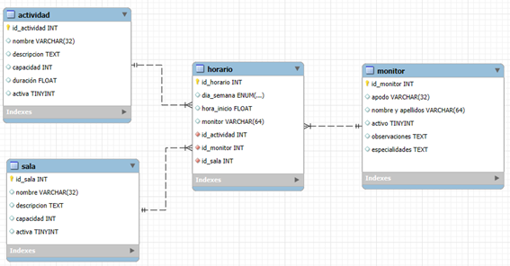

# 📦 Paso 5 — `_5_propuesta_ampliacion`

**Objetivo:** Ampliar el addon con dos nuevos modelos de datos y sus relaciones.

---

## 🧠 ¿ Eres capaz de ampliar el addon añadiendo nueva funcionalidad

    Te proponemos ampliar el addon con dos nuevos modelos de datos; los monitores y las salas. 
    
    Los monitores son las personas que dan las clases en el gimnasio. Se deben tener registradas y asociarlas a las sesiones 
    semanales que están registradas en los horarios. 

    Las salas son los distintos recintos que tiene acondicionado el gimnasio para las sesiones según la actividad. 
    Las sesiones semanales del horario deben indicar en que sala en la que se van a impartir.

---

## Esquema de modelos de datos

    Se propone el siguiente esquema que combina los modelos iniciales de actividades y horarios con estos nuevos de salas y monitores.
    Es sólo una propuesta, tu puedes cambiarlo si tienes otras ideas.

